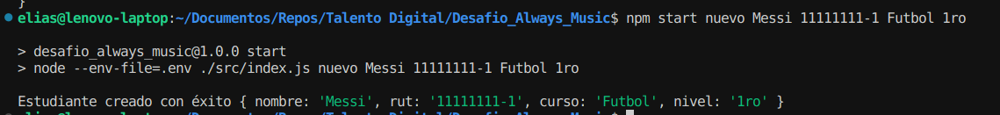

# Desafio Always Music

### Para inicializar el programa se requiere:

1. Instalar las dependencias usadas con el comando `npm i`.
2. Se requiere crear una database en postgres usando las consultas en la carpeta SQL.
3. Crear un archivo `.env` con las variables de entorno necesarias (DB_USER, DB_PASSWORD, DB_HOST, DB_PORT, DB_DATABASE)
4. Se requiere ejecutar el programa con el comando `npm start`.

### Comandos aceptados

1. `npm start nuevo` - Este parametro acepta 4 argumentos (Nombre, Rut, Curso, Nivel, en ese orden) y crea un nuevo estudiante en la base de datos.
2. `npm start consulta` - Lista todos los estudiantes.
3. `npm start editar` - Este parametro acepta 4 argumentos (Nombre, Rut, Curso, Nivel, en ese orden) y edita el estudiante en la base de datos en base al rut.
4. `npm start rut` - Lista el estudiante en base al rut.
5. `npm start eliminar` - Este parametro acepta 1 argumento (Rut) y elimina un estudiante en base al rut.

### Ejemplo de uso

## Josué Gallardo - g68 Bootcamp Talento Digital - Desafío Latam
